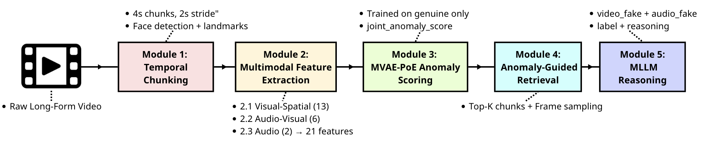
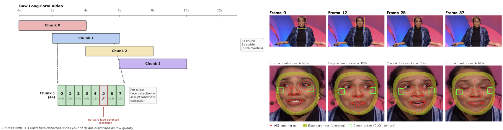
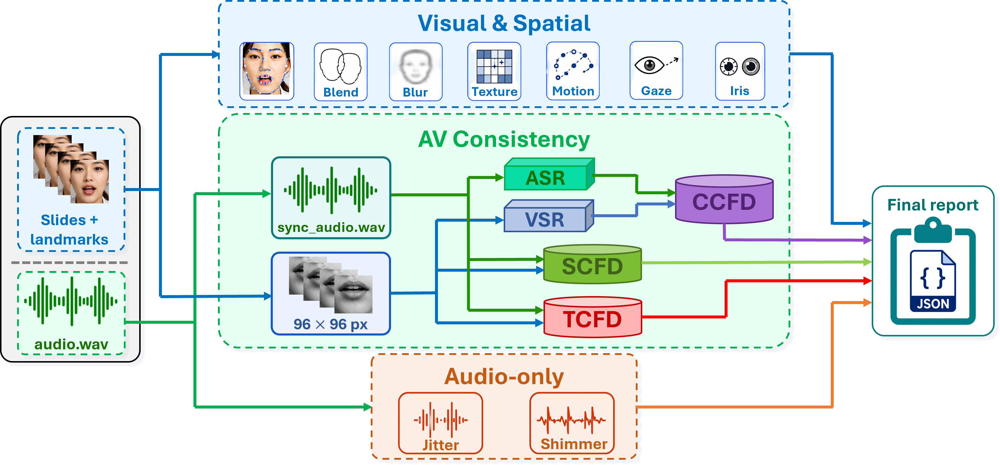
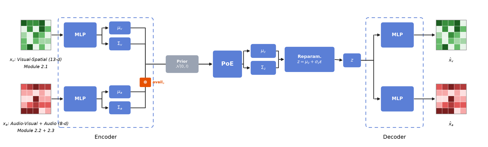
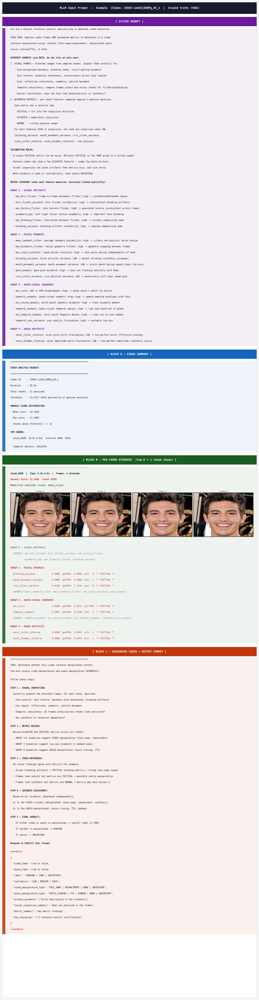
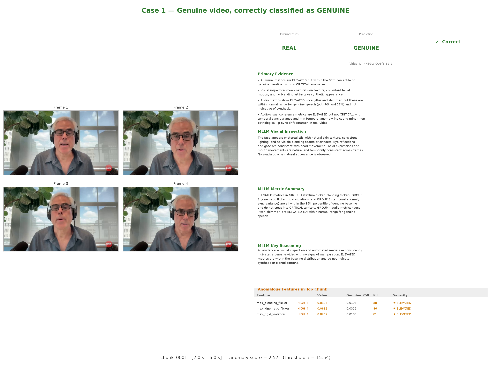
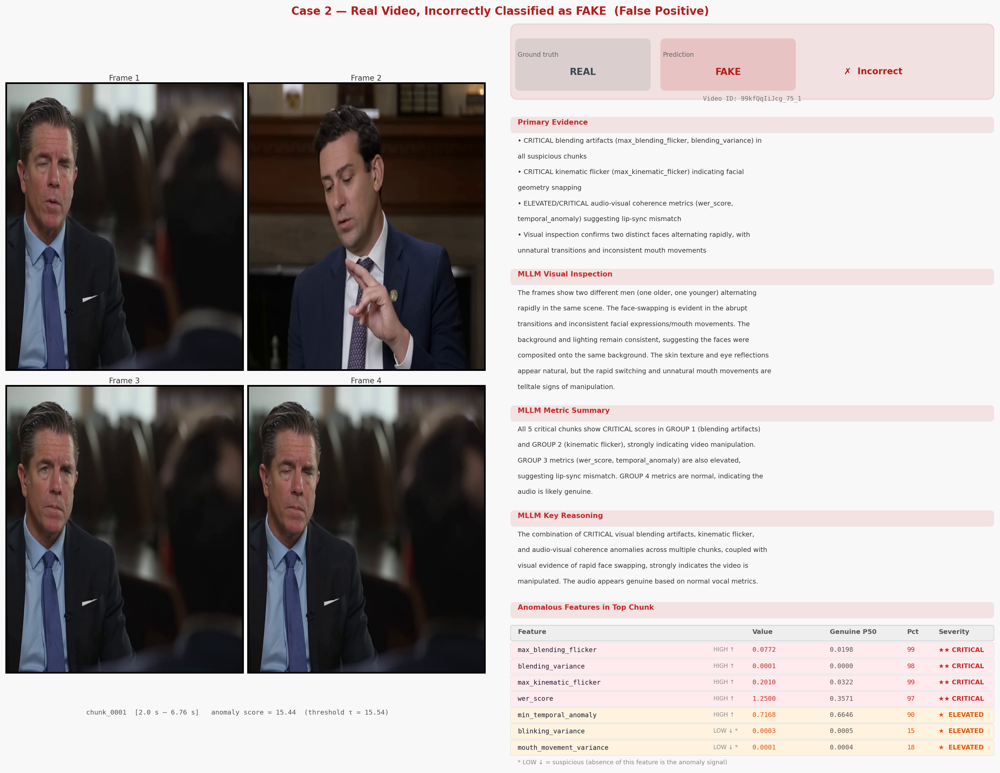
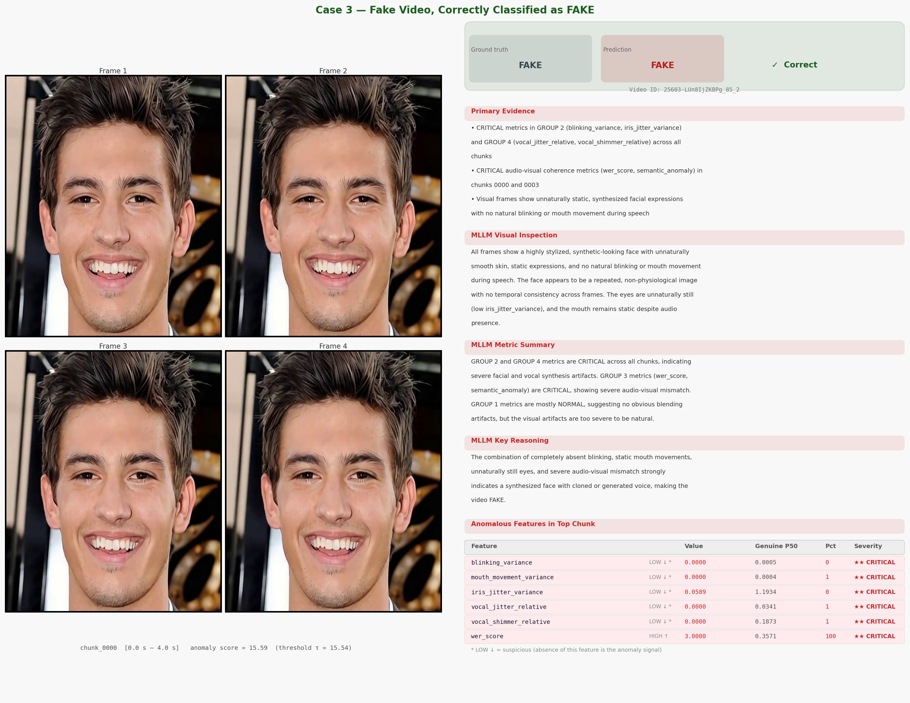

<div align="center">

# VERA: A Scalable Zero-Shot Framework for Explainable Deepfake Detection in Long-Form Video

**Ung Hoang Long · Truong Tran Duy Dinh · Son T. Luu***

University of Information Technology, VNU-HCM, Ho Chi Minh City, Vietnam

*Corresponding author · Published at **CSoNet 2026** (LNCS, Springer Nature)*

[](https://github.com/UngHoangLong/VERA)
[](vera_mavosdd_splits/)
[](LICENSE)

</div>

---

## Overview

**VERA** (**V**ideo **E**vidence **R**easoning and **A**nalysis) is a modular, zero-shot pipeline for detecting and explaining deepfakes in long-form video — **without any fake training data or MLLM fine-tuning**.

<p align="center">
  
  <br/>
  <em>Five-stage VERA pipeline: temporal chunking → multimodal feature extraction → anomaly scoring → retrieval → MLLM reasoning.</em>
</p>

### Key Results on MAVOS-DD (English subset, 4,891 videos)

| Stage | AUC | Accuracy | Recall | F1 |
|---|---|---|---|---|
| Module 3 — Anomaly Scoring only | 0.559 | 36.25% | 4.72% | 8.78% |
| **Module 5 — MLLM Reasoning (VERA)** | **0.594** | **67.08%** | **84.94%** | **77.04%** |
| AVH-Align (zero-shot baseline) | 0.593 | — | — | — |

> **+80 percentage points** in recall: MLLM reasoning over anomaly-guided evidence closes the gap that handcrafted features alone cannot.

Recall by generative method (Module 5):

| Sonic | EchoMimic | MEMO | LivePortrait | Roop | InSwapper | KNNVC | HifiFace |
|---|---|---|---|---|---|---|---|
| 100% | 99.3% | 97.8% | 90.2% | 87.8% | 86.7% | 77.5% | 77.0% |

---

## Why VERA?

| Challenge | VERA's approach |
|---|---|
| Most detectors require fake training data | Module 3 trains **only on genuine videos** |
| MLLM methods need fine-tuning on forensic datasets | Module 5 uses a **frozen** Qwen3-VL-8B, zero-shot |
| Long videos cannot be fed whole to an MLLM | Module 4 **retrieves the top-K most anomalous chunks** |
| Black-box predictions are unacceptable | Module 5 produces **per-modality verdicts with free-text reasoning** |

---

## Pipeline

### Module 1 — Temporal Chunking & Face Detection

<p align="center">
  
</p>

- Standardizes to 25 fps / 16 kHz audio
- Sliding-window chunks: **4 s** length, **2 s** stride (50% overlap)
- Each chunk → 8 non-overlapping 0.5-second slides
- Per-frame face detection via MediaPipe FaceMesh; 468 landmarks extracted and normalized
- Chunks with fewer than 4 valid single-face slides are discarded

### Module 2 — Multimodal Feature Extraction (21 features)

<p align="center">
  
</p>

Three parallel branches:

| Branch | Features | Key signals |
|---|---|---|
| **2.1 Visual-Spatial** | 13 | Boundary blending, blur inconsistency, cheek texture, landmark kinematics, gaze-pose sync, iris jitter |
| **2.2 Audio-Visual Consistency** | 6 | ASR–VSR transcript comparison (Whisper + Auto-AVSR), AV-HuBERT embedding similarity, lip-audio sync (VocaLiST) |
| **2.3 Audio-Only Artifacts** | 2 | Vocal jitter, vocal shimmer |

### Module 3 — MVAE-PoE Anomaly Scoring

<p align="center">
  
</p>

- Adapts MVAE-PoE ([Zhao et al., 2024](https://arxiv.org/abs/2404.xxxxx)) for anomaly detection
- Trained **exclusively on genuine-video chunks** — no fake exemplar seen
- Precision-weighted Product-of-Experts fusion of visual and audio views
- Anomaly score: `s = L_visual + L_audio · avail_audio + β · L_KL`
- Threshold τ = 15.54 (95th percentile of genuine validation scores)

### Module 4 — Anomaly-Guided Retrieval

- Selects **top-K = 5** chunks by anomaly score from the full video
- Samples **N = 4** evenly spaced frames per chunk
- Computes a temporal pattern label (isolated / concentrated / scattered / mixed)
- Bundles frames + per-chunk evidence into a single structured package

### Module 5 — Zero-Shot MLLM Reasoning

<p align="center">
  
</p>

- Passes the evidence package to **frozen Qwen3-VL-8B-Instruct** in a single zero-shot prompt
- Three-block prompt: (A) video-level summary, (B) per-chunk features + sampled frames, (C) five-step reasoning chain
- Outputs structured JSON with:
  - `video_fake` / `audio_fake` — separate flags per modality
  - `label` — FAKE / GENUINE / UNCERTAIN
  - `confidence`, manipulation type, free-text reasoning

---

## Qualitative Case Studies

<p align="center">
  
  <br/><em>Case 1 — Genuine video correctly classified as GENUINE (anomaly score 2.57 ≪ τ = 15.54).</em>
</p>

<p align="center">
  
  <br/><em>Case 2 — Genuine multi-speaker interview incorrectly flagged as FAKE. Hard scene cuts between speakers trigger blending/kinematic CRITICAL features — the primary source of false positives.</em>
</p>

<p align="center">
  
  <br/><em>Case 3 — TTS + facial-animation deepfake correctly classified as FAKE. Near-zero blinking, mouth, and iris variance indicate synthetic animation; vocal jitter/shimmer indicate cloned voice.</em>
</p>

---

## Dataset

Evaluated on the **English subset of MAVOS-DD** ([Croitoru et al., 2025](https://arxiv.org/abs/2503.xxxxx)).

| Split | Usage | # Videos |
|---|---|---|
| Genuine train | Module 3 training | 3,234 |
| Genuine validation | Early stopping + threshold calibration | 513 |
| Evaluation — genuine | — | 1,711 |
| Evaluation — video-only fake | Face-swap / reenactment | 2,222 |
| Evaluation — audio-only fake | Voice cloning / TTS | 543 |
| Evaluation — both fake | Video + audio manipulated | 415 |
| **Evaluation total** | | **4,891** |

Video manipulations: HifiFace, Roop, InSwapper, EchoMimic, Sonic, LivePortrait, MEMO  
Audio manipulations: KNNVC, FreeVC, OpenVoice, XTTS-v2, VITS

**VERA-filtered split IDs** (genuine train/dev + evaluation set) are released under [`vera_mavosdd_splits/`](vera_mavosdd_splits/) for reproducibility.

---

## Installation

```bash
# Clone and create environment
git clone https://github.com/UngHoangLong/VERA.git
cd VERA

# Core dependencies (Modules 1, 2.1, 2.3)
pip install -r requirements.txt

# Module 3
pip install -r src/module_3_autoencoder/requirements.txt
```

**Module 2.2** additionally requires pretrained model weights for Auto-AVSR, AV-HuBERT, and VocaLiST, plus two external repositories (`av_hubert`, `MTDVocaLiST`) placed adjacent to the project root. See [`src/module_2_extraction/module_22_audio_visual_consistency/readme.md`](src/module_2_extraction/module_22_audio_visual_consistency/readme.md).

**Module 5** requires a Qwen3-VL-8B-Instruct model (local or API). Place credentials in `configs/.env`.

---

## Usage

### 1. Feature extraction (genuine videos → train Module 3)

```bash
# Place genuine videos in data/raw/genuine/
python src/module_1_chunking/video_slicer.py --mode genuine
python src/module_2_extraction/module_21_visual_spatial_anomalies/main_21.py --mode genuine
python src/module_2_extraction/module_22_audio_visual_consistency/main_22.py --mode genuine
python src/module_2_extraction/module_23_audio_only/main_23.py --mode genuine
```

### 2. Train anomaly scorer

```bash
cd src/module_3_autoencoder
./run_train.sh
# → module3_models/{mvae_poe.pt, preprocessor.joblib, threshold.json, feature_baseline.json}
```

### 3. Run inference on a target video

```bash
# Place video(s) to evaluate in data/raw/infer/
python src/module_1_chunking/video_slicer.py --mode infer
python src/module_2_extraction/module_21_visual_spatial_anomalies/main_21.py --mode infer
python src/module_2_extraction/module_22_audio_visual_consistency/main_22.py --mode infer
python src/module_2_extraction/module_23_audio_only/main_23.py --mode infer

cd src/module_3_autoencoder
./run_infer.sh
# → evidence_infer/<video_id>_evidence.json
```

### 4. MLLM reasoning (Module 5)

```bash
python src/module_5_agent/mllm_client.py --evidence-dir evidence_infer/
# → verdict JSON per video: label, confidence, per-modality flags, reasoning
```

---

## Repository Structure

```
VERA/
├── src/
│   ├── module_1_chunking/          # Temporal chunking & face detection
│   ├── module_2_extraction/
│   │   ├── module_21_visual_spatial_anomalies/
│   │   ├── module_22_audio_visual_consistency/
│   │   └── module_23_audio_only/
│   ├── module_3_autoencoder/       # MVAE-PoE training & inference
│   ├── module_4_retrieval/         # Anomaly-guided chunk retrieval
│   ├── module_5_agent/             # Zero-shot MLLM reasoning
│   └── utils/
├── vera_mavosdd_splits/            # Train / dev / test video IDs
│   ├── train_ids.txt               # 3,234 genuine videos
│   ├── dev_ids.txt                 # 513 genuine videos
│   └── test_ids.txt                # 4,891 evaluation videos
├── CSONET2026/                     # Paper source (LaTeX)
├── configs/
└── requirements.txt
```

---

## Citation

If you use VERA or the MAVOS-DD split IDs in your research, please cite:

```bibtex
@inproceedings{ung2026vera,
  title     = {VERA: A Scalable Zero-Shot Framework for Explainable Deepfake Detection in Long-Form Video},
  author    = {Ung, Hoang Long and Tran Duy Dinh, Truong and Luu, Son T.},
  booktitle = {Computational Science and Network Intelligence (CSoNet 2026)},
  series    = {Lecture Notes in Computer Science},
  publisher = {Springer Nature},
  year      = {2026}
}
```

---

## Acknowledgements

Computational resources provided by the University of Information Technology, VNU-HCM.  
AI-assisted copy editing performed using Claude (Anthropic).
